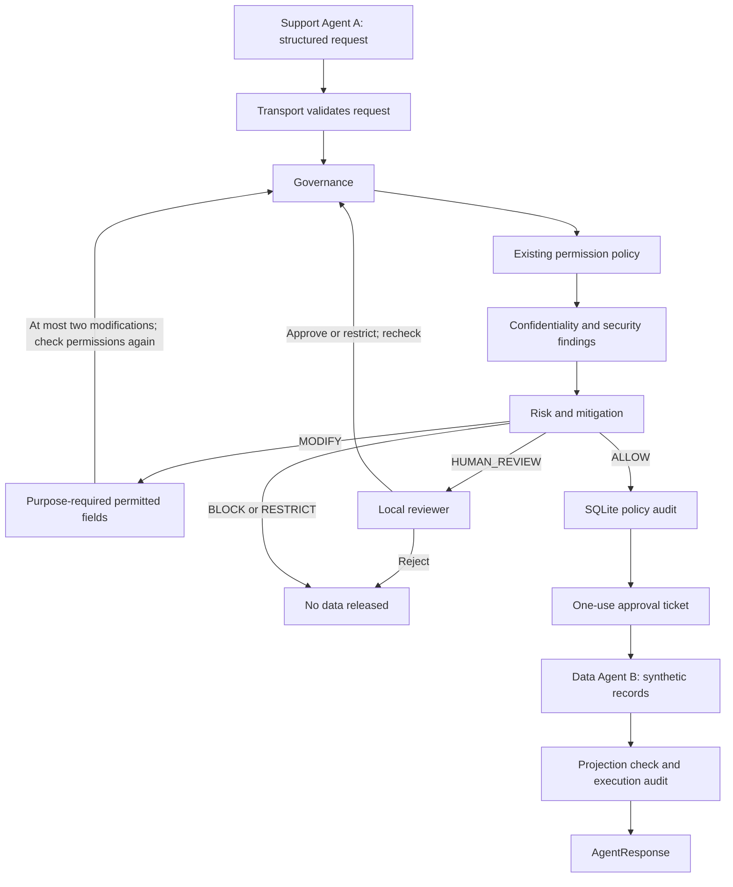

# Architecture

The existing permissions dictionary is authoritative. The Governance adapter validates
the AgentA/AgentB identities and checks explicit fields. Wildcards express a request
for a safe projection, not a grant of unrestricted access. Every concrete modified
request must pass permissions again before retrieval.

Agent A builds `AgentRequest` and token metadata. Communication assigns a unique ID
and converts it into Governance's `Request`. `GovernanceResult` carries findings,
authorization, final decision, optional modified request and a per-pass trajectory.
`AgentResponse.data` contains only returned customer fields; diagnostics use metadata.

Probing history and pending reviews belong to one communication instance. Streamlit
keeps one instance per scenario in its browser session. SQLite persists across reruns.
No HTTP agent services, external LLMs, or production authentication are introduced.

An opaque approval is consumed exactly once by DataAgent. This is an in-process
application boundary; Python code and fixtures are trusted, not sandboxed adversaries.
Governance failure prevents the read; execution-audit failure withholds its response.
